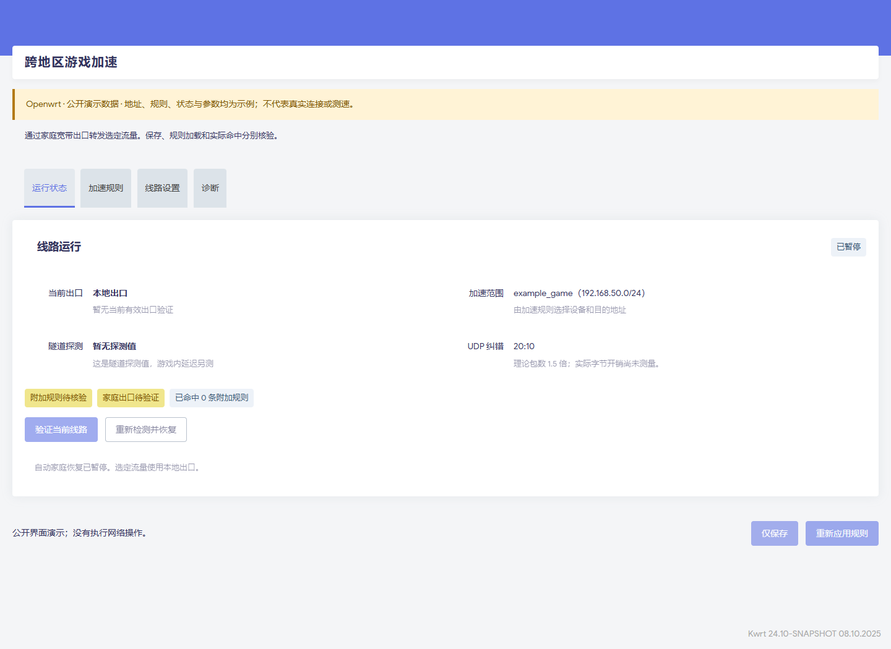
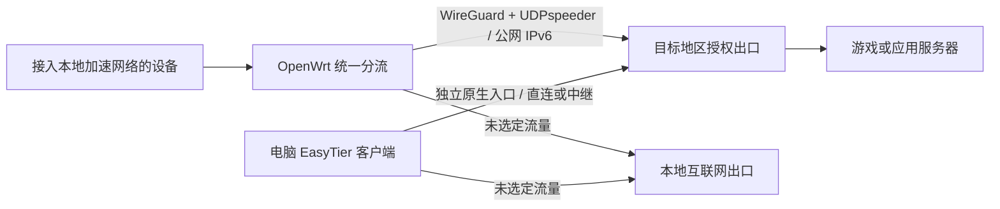

# EasyTier Cross-Region Game Accelerator

**基于 EasyTier 的跨地区游戏接入与 OpenWrt 流量分流工具。**

通过隧道将本地选定的游戏或应用流量送到另一地区的授权出口，再由该出口访问目标服务器。出口须由你管理或明确获授权，可以是中国的公网出口主机或家庭宽带，也可以位于其他国家或地区。

主要模式由**本地 OpenWrt 软路由统一分流**。软路由按设备和目标规则选择流量，接入加速网络的设备可共用线路，无需各自安装客户端。这条网关链路整合了 WireGuard、UDPspeeder 纠错、端点更新和线路状态管理。

电脑也可以通过官方 EasyTier 客户端独立接入授权出口，使用自己的连接配置。实际效果取决于线路，需要自行对照验证。

[English user guide](docs/USER-GUIDE.en.md) · [中文部署说明](docs/DEPLOY.md) · [AI 操作入口](AGENTS.md)

## 适合谁

- 希望在本地 OpenWrt 上统一转发选定设备的游戏或应用流量，同时保留其他流量的本地出口。
- 有自己管理或明确获授权的目标地区出口，能配置隧道接入和互联网转发。
- 希望电脑独立连接同一地区出口，使用匹配的客户端配置并单独验证。

这套结构适用于跨国或同一国家内的跨地区连接，具体国家、运营商和固件组合仍需验证。项目不提供现成公共出口，也不会自动加入他人的网络。

## 接入方式与出口角色

| 接入方式 | 流量范围 | 当前提供的内容 |
| --- | --- | --- |
| **OpenWrt 网关接入（主要模式）** | 接入加速网络的设备，按来源、目的地址、协议和端口选择 | LuCI 管理、网关部署脚本、WireGuard + UDPspeeder 纠错、端点更新与出口验证 |
| **电脑客户端独立接入** | 安装客户端的这台电脑，由客户端配置决定路由范围 | 官方 EasyTier GUI 的配置、检查与 AI 部署说明；原生入口不自动包含上述纠错链路 |

出口端接收隧道流量，通过目标地区的网络访问服务器。兼容路由器、Linux 主机或具备运行条件的 NAS 可以承担这个角色，但需匹配接入协议并配置互联网转发。现有自动部署脚本仅面向 OpenWrt 出口，其他平台需另行部署和验证。

电脑要通过公网地址直连，出口端需开放匹配的 EasyTier 原生入口，并完成网络身份和路由配置。连接后应检查实际路径，区分公网直连与共享节点中继。路由器的 WireGuard 配对文件不能直接用作原生 EasyTier 配置，见[电脑接入说明](docs/WINDOWS-TRAVEL.md)。

“授权出口”指你能配置隧道和互联网转发的设备；最终游戏或应用服务器是它要访问的目标。公网地址本身不提供出口服务。

## 可以做什么

OpenWrt 网关模式提供以下管理功能；电脑独立接入使用官方客户端，按对应文档配置。

- 在原有 **VPN → EasyTier → 跨地区游戏加速** 菜单中管理线路，继承 LuCI 主题。
- 按设备、目的 IPv4、协议和端口保存、应用及检查分流规则。
- 区分“已保存”“已加载”“已命中”，查看实际防火墙条件和流量计数。
- 从固定授权节点发现公网 IPv6 变化，更新隧道入口并主动验证出口。
- 出口验证失败时恢复本地路线，支持暂停、恢复、诊断和只撤销自身修改的备份回退。
- 为 AI 提供部署顺序、配置模板、检查命令和失败处理说明。



截图仅展示操作界面；节点、地址、状态和参数均为示例，不包含所有者的网络资料或个人测速记录。



## 条件和当前范围

**当前 OpenWrt 网关脚本**要求接入端和出口端均为可管理的 OpenWrt，具备可用公网 IPv6，并准备匹配架构的 EasyTier、WireGuard 和 UDPspeeder。动态地址发现使用自有授权 ZeroTier 网络的节点路径。独立电脑入口应按自己的协议和出口配置检查。

客户端脚本面向 fw4/nftables，出口端面向 fw3/iptables。其他版本、纯 IPv4 和不同架构须另行适配与验证，见[兼容性说明](docs/COMPATIBILITY.md)。当前提供源码预览，尚未提供经过完整构建验收的 IPK。

网关规则按目的 IPv4 设置。本版本尚未完整实现所有应用服务器的自动识别、目的 IPv6 分流和纯 IPv4 纠错线路。电脑独立入口需检查直连或中继路径、实际出口，以及停止连接后的路由释放。Windows 上 WireGuard + UDPspeeder 的完整链路尚未验收。

## 开始部署

OpenWrt 网关模式先阅读[部署文档](docs/DEPLOY.md)，安装依赖并填写接入端与出口端配置：

```sh
et-game doctor
et-game plan
et-game apply
et-game verify
```

接管已经运行的本项目线路时，先 `et-game adopt`，保留原有身份、无线网络和纠错参数。不要把同一身份和虚拟地址直接复制给另一台路由器或电脑。

电脑独立接入从[电脑接入说明](docs/WINDOWS-TRAVEL.md)和[电脑 AI 部署提示词](docs/PORTABLE-AI-PROMPT.md)开始；`et-game` 是 OpenWrt 网关管理命令。

可交给 AI：

> 阅读仓库 AGENTS.md 和 README，先确定使用 OpenWrt 网关接入还是电脑独立接入，再阅读对应部署文档。检查接入端和授权出口条件，按该模式配置并验证实际连接路径、选定出口、普通网络和停止恢复；报告通过、失败和未执行项目，不公开私人连接资料。

## 规则生效与使用成本

“仅保存”只保存草稿；“保存并应用”才部署并核对实际规则、策略路由和新出口。流量计数增加说明发生匹配，不等于游戏一定更快。应用效果应按[验收方法](docs/ACCEPTANCE.md)自行对照。

已有接入网络和授权出口时，可以自行部署，无需商业游戏加速器订阅。设备、网络、出口主机和纠错流量仍有成本。

网关模式的 FEC 参数必须两端一致。以 `2:30` 为数学示例，理论总包数为 16 倍、额外 1500%；`20:10` 理论为 1.5 倍。这些参数并非所有线路的默认最佳值，实际字节成本需测量。

## 公共学习资源

[VPN Gate 公益 VPN 项目](https://www.vpngate.net/en/) 可用于学习公共 VPN 连接和协议。**本项目不保证其有效性、可用性或安全性，请谨慎使用。** 它不是本项目的默认节点，也不代表有适用于你的目标地区的免费游戏出口。[更多说明](docs/PUBLIC-RESOURCES.md)

## 隐私与项目名称

公开代码仅包含示例配置、验证方法和演示截图，不公开所有者的公网 IP、账号口令、网络身份、配对资料、运行日志或个人测速记录。私人配置必须通过自己的渠道传输，不放公共 Issue。

为兼容已有部署，保留内部包名 `luci-app-easytier-home-game`、UCI 名称和 `et-game` 命令。项目公开名称为 **EasyTier Cross-Region Game Accelerator**。

## 上游与许可

[EasyTier](https://github.com/EasyTier/EasyTier)、[luci-app-easytier](https://github.com/EasyTier/luci-app-easytier)、[WireGuard](https://www.wireguard.com/)、[UDPspeeder](https://github.com/wangyu-/UDPspeeder)、[ZeroTier](https://github.com/zerotier/ZeroTierOne)。隧道、P2P、WireGuard 和纠错算法来自上游；本项目提供部署、分流、状态验证与管理整合。新增代码采用 Apache-2.0，第三方组件保留原许可。
