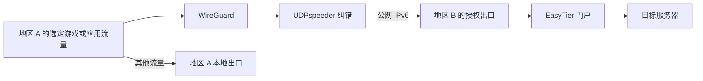

# EasyTier Cross-Region Game Accelerator

**基于 EasyTier 的 OpenWrt 跨国家、跨地区游戏加速方案。**

把一个地区的软路由连接到另一个地区由你管理的宽带出口，通过选定流量分流、WireGuard 和 UDPspeeder 纠错，改善跨地区游戏连接。也可为需要特定地区出口的应用配置规则。效果取决于实际线路，需要自行对照验证。

[English user guide](docs/USER-GUIDE.en.md) · [中文部署说明](docs/DEPLOY.md) · [AI 操作入口](AGENTS.md)

## 适合谁

- 两地都有自己管理或明确获授权的 OpenWrt 路由器和宽带出口。
- 希望通过目标地区出口访问游戏服务器或区域应用，同时保留其他流量的本地出口。
- 愿意检查两端条件，先验证连接，再决定是否启用加速范围。

项目不限于回国场景。跨国家或同一国家不同地区都可以采用这套结构，但不代表所有国家、运营商和固件组合均已验证。项目不提供现成公共出口，也不会自动加入他人的网络。

## 可以做什么

- 在原有 **VPN → EasyTier → 跨地区游戏加速** 菜单中管理线路，继承 LuCI 主题。
- 按设备、目的 IPv4、协议和端口保存、应用及检查分流规则。
- 区分“已保存”“已加载”“已命中”，查看实际防火墙条件和流量计数。
- 从固定授权节点发现公网 IPv6 变化，更新隧道入口并主动验证出口。
- 出口验证失败时恢复本地路线，支持暂停、恢复、诊断和只撤销自身修改的备份回退。
- 为 AI 提供部署顺序、配置模板、检查命令和失败处理说明。


截图仅展示操作界面；节点、地址、状态和参数均为示例，不包含所有者的网络资料或个人测速记录。



## 条件和当前范围

两端需可管理的 OpenWrt、可用公网 IPv6，以及匹配架构的 EasyTier、WireGuard 和 UDPspeeder。当前动态地址发现还使用自有授权 ZeroTier 网络的节点路径。

客户端脚本面向 fw4/nftables，出口端面向 fw3/iptables。其他版本、纯 IPv4 和不同架构须另行适配与验证，见[兼容性说明](docs/COMPATIBILITY.md)。当前提供源码预览，不提供声称经过完整构建验收的 IPK。

规则按目的 IPv4 设置；自动识别所有应用服务器、目的 IPv6 分流和纯 IPv4 纠错线路不属于本版本的完整功能。电脑离开软路由后需要独立客户端，见[电脑接入说明](docs/WINDOWS-TRAVEL.md)。

## 开始部署

先阅读[部署文档](docs/DEPLOY.md)，安装依赖并填写两端配置：

```sh
et-game doctor
et-game plan
et-game apply
et-game verify
```

接管已经运行的本项目线路时，先 `et-game adopt`，保留原有身份、无线网络和纠错参数。不要把同一身份和虚拟地址直接复制给另一台路由器或电脑。

可交给 AI：

> 阅读仓库 AGENTS.md 和部署说明，检查两端条件，填写配置并按项目脚本部署。验证选定出口、普通网络、暂停恢复及地址变化；报告通过、失败和未执行项目，不公开私人连接资料。

## 规则生效与使用成本

“仅保存”只保存草稿；“保存并应用”才部署并核对实际规则、策略路由和新出口。流量计数增加说明发生匹配，不等于游戏一定更快。应用效果应按[验收方法](docs/ACCEPTANCE.md)自行对照。

在已有两地宽带和设备的条件下，可自行部署而不依赖商业游戏加速器订阅；仍需承担宽带、设备及纠错流量。FEC 必须两端一致。以 `2:30` 为数学示例，理论总包数为 16 倍、额外 1500%；`20:10` 理论为 1.5 倍。参数不是所有线路的默认最佳值，实际字节成本需测量。

## 公共学习资源

[VPN Gate 公益 VPN 项目](https://www.vpngate.net/en/) 可用于学习公共 VPN 连接和协议。**本项目不保证其有效性、可用性或安全性，请谨慎使用。** 它不是本项目的默认节点，也不代表有适用于你的目标地区的免费游戏出口。[更多说明](docs/PUBLIC-RESOURCES.md)

## 隐私与项目名称

公开代码仅包含示例配置、验证方法和演示截图，不公开所有者的公网 IP、账号口令、网络身份、配对资料、运行日志或个人测速记录。私人配置必须通过自己的渠道传输，不放公共 Issue。

为保留已有部署兼容性，内部包名 `luci-app-easytier-home-game`、UCI 名称和 `et-game` 命令保留；这些是内部标识，公开名称为 **EasyTier Cross-Region Game Accelerator**。

## 上游与许可

[EasyTier](https://github.com/EasyTier/EasyTier)、[luci-app-easytier](https://github.com/EasyTier/luci-app-easytier)、[WireGuard](https://www.wireguard.com/)、[UDPspeeder](https://github.com/wangyu-/UDPspeeder)、[ZeroTier](https://github.com/zerotier/ZeroTierOne)。隧道、P2P、WireGuard 和纠错算法来自上游；本项目提供部署、分流、状态验证与管理整合。新增代码采用 Apache-2.0，第三方组件保留原许可。
