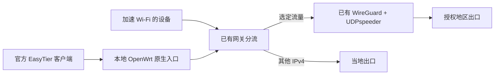

# 官方电脑客户端复用已有 OpenWrt 纠错网关

这条路径适合已有可用两地网关，想让电脑用官方 EasyTier 客户端接入同一后端的部署。它保留路由器上的 WireGuard + UDPspeeder，电脑增加一个原生 EasyTier 接入段。直接连接远端原生入口则是另一种路径，见 [电脑接入说明](WINDOWS-TRAVEL.md)。

本版提供脱敏模板、手工配置顺序和排查方法。管理员仍需配置原生入口服务、系统转发、分流/NAT 与重载恢复；`scripts/install.sh` 不会自动创建这一层桥接。模板通过配置检查不等于新设备或外出网络验收。



## 准备已有线路

先按 [部署文档](DEPLOY.md) 完成 `et-game doctor / plan / apply / verify`，或使用 `adopt` 接管已有配置。记录原 WG 设备/源地址、加速网络、分类集合或规则、标记、策略路由表、家庭入口、WAN 出口和当前验证状态。保留原身份、Wi-Fi、IPv6、应用 DNS 与 FEC 参数。

新原生入口使用单独的客户端网段。本说明选择 `10.77.90.0/24`、入口虚拟地址 `10.77.90.1`、LAN 地址 `192.168.8.1` 和端口 `21121` 作为示例，部署前检查与现有 LAN、WG 和其他 VPN 没有冲突。

## 设置网关原生入口

使用与设备架构匹配的官方 core 2.6.4，填好 [native-gateway.toml](../examples/native-gateway.toml)。两端设置相同的自有 `network_name`/`network_secret`，替换示例 LAN 入口和虚拟网段。入口地址应在受控 LAN 或已授权的私网接口上可达。

模板让系统栈负责转发，并声明 IPv4 子网代理/出口能力。它只建立原生入口，已有系统还须允许其 TUN 转发。可以先检查配置：

```sh
easytier-core -c /path/to/native-gateway.private.toml --check-config
```

运行时使用自己管理的 procd 服务并准备停止清理；若启用 `--multi-thread true`，依据实际 CPU/内存和观察结果评估。本机入口不要求更换原家庭核心版本或重新生成 WireGuard 身份。

## 接上原分类、策略路由和出口

新 TUN 示例名为 `etnative`。只对该接口、`10.77.90.0/24` 来源和原选定目标设置家庭标记，进入已有家庭策略表；当地出口流量有单独可用的 forward/NAT。已有区域 UDP 集合的部署，可参考 [nft 表达式](../examples/native-classifier.reference.nft)。该文件是表达式参考，不是完整可直接安装的防火墙。

若全新线路只有 LuCI 中配置的特定目的规则，则按那些真实规则构造新的来源条件。`cn_games4` 不是每台新安装设备自动存在的集合，不能仅复制集合名称。区域地址记录也不等于应用自动识别。

在 WG 链路原允许范围不包含新客户端网段时，扩展家庭端允许范围，或只把新网段从家庭 WG 出口的源地址转换为该链路原允许的 WG 源。保持原家庭端的出口 NAT。随后检查实际双向连接，具体困难见 [源 NAT 排查](DEPLOYMENT-LESSONS.md#4-分流标记有了家庭出口却收不到返回包)。

DNS/NTP 排除、原底层端点绕行和已有 MSS 规则都要保留。若原 DNS 重定向影响新增接口，仅对该来源配置合适的处理。当前示例没有增加全 IPv6 目的分流，不能通过关闭 IPv6来省去检查。

## 设置 Windows 官方客户端

1. 从 [官方下载页](https://easytier.cn/guide/download.html) 进入官方 Release，安装 GUI 2.6.4，核对对应架构及官方 SHA-256。建立直接打开官方 exe 的快捷方式。
2. 修改 [native-client.auto.toml](../examples/native-client.auto.toml) 的入口、出口虚拟地址、网段和共享凭据，使其与上一步网关一致，再通过官方配置编辑器导入完整 TOML、保存并运行。
3. 模板省略 `instance_id` 和固定 `ipv4`，启用 `dhcp=true`。同一份填好的私人配置可以用于多台获授权电脑。官方程序自动生成本地实例标识并选择可用虚拟 IPv4；使用者不必逐台手填身份或 IP。入口须先连接成功，才有已在线节点供它发现网段。[2.6.4 地址分配实现](https://github.com/EasyTier/EasyTier/blob/v2.6.4/easytier/src/instance/instance.rs)
4. `routes` 中两段 `/1` 将 IPv4 交给现有网关选择出口。确认入口及其他底层连接的更具体绕行路线，核对实际 Windows 路由。这个模式中的“全 IPv4 接入”不等于全 IPv4 都去家庭。
5. 确认各客户端地址没有冲突，既有入口地址保持固定；原电脑恢复文件如果写死地址，不作为多机同时运行的模板。共享网络凭据不等于复制 WireGuard 或 ZeroTier 整机身份。

电脑停用连接后检查其路线释放，再运行检查恢复。官方窗口关闭可能只是缩到托盘，日常启停使用官方界面的运行/禁用按钮。

## 重载、动态端点与外出

入口自己的规则需要随 fw4 重载恢复。使用唯一注释/自有表，服务启动时启用状态开关、停用时先撤销开关并清理自己添加的规则；重载回调不得在停用后重新加回规则。恢复原可用后端，保留新入口的有范围备份。

家庭公网地址变化继续由已有 `codex-game-endpoints` 管理。不要给每台电脑另造一套端点任务。它检查授权对端、更新变化项并验证家庭出网；检测间隔与验证有效期是不同参数。新客户端 DHCP 管理的是虚拟地址，与家庭公网 IPv6 更新不同。

局域网入口可用后再测真实外出。若外出通过另一个自有私网访问该入口，新节点需授权，底层应排除新增 TUN/网段。客户端的完整 IPv4 路由不能截获自己的底层。两地网关都需要保持在线。

更换 Wi-Fi、热点或实际 IP 应继续使用同一配置。底层绕行须适应当前物理接口和网关；旧网卡路线、虚拟 DHCP 和家庭端点更新分别核对。按[换网要求](NETWORK-ROAMING.md)实际切换后验收，不能用局域网入口成功推断移动恢复已完成。

## 验收这条新增路径

| 检查 | 需要看到什么 |
| --- | --- |
| 官方客户端 | 配置保存读回、真实节点可见、可用虚拟地址与网卡 |
| Windows 路由 | `/1` 或自己选择的范围真实安装，底层仍可达 |
| 网关分类 | 新接口/来源匹配原选定条件，没有重复或失效规则 |
| 返程 | 家庭策略表、WG 源允许范围、源 NAT 与双向流量一致 |
| 普通网络 | 未选定 IPv4 经当地出口，DNS 和原 IPv6 正常 |
| 家庭路径 | 当前端点验证有效，选中连接经过原 FEC 后端 |
| 生命周期 | 停用只清理自己的路线/规则，重载与重开恢复实际有效 |
| 应用和外出 | 同场景对照；另一台机器、热点、酒店、重启分别记录 |

这条路径多了一段本地原生接入；实际 MTU 和延迟应分别测量。原生客户端没有再次叠加 UDPspeeder，新增接口也不自动继承原 Wi-Fi 的全部特定软件 TCP/DNS 规则。
